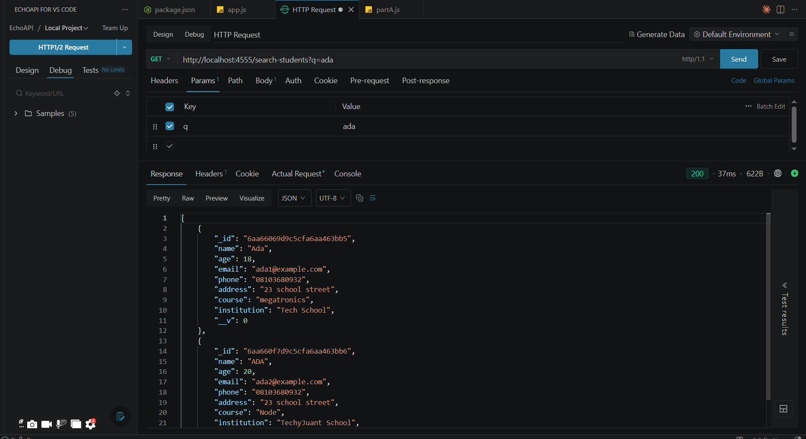
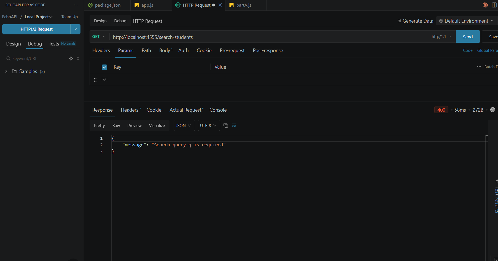
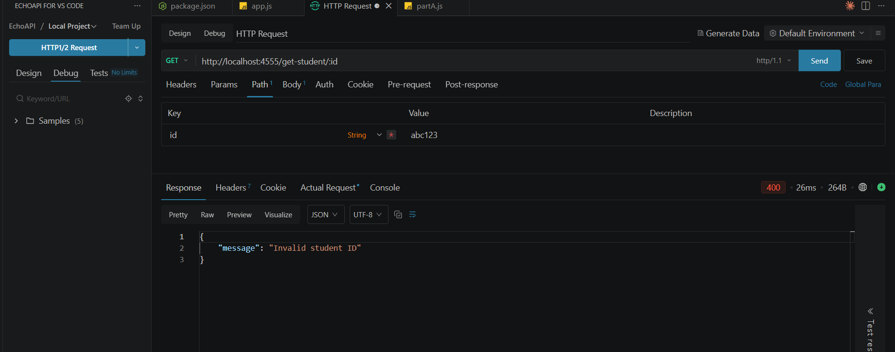
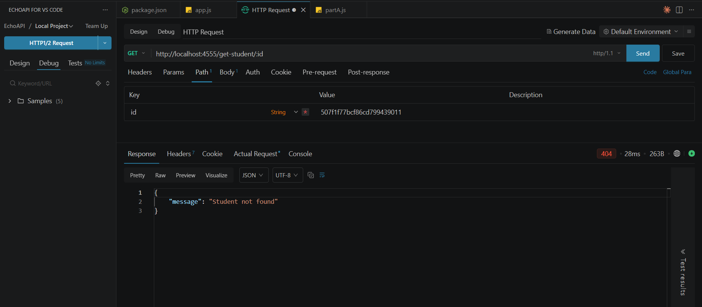
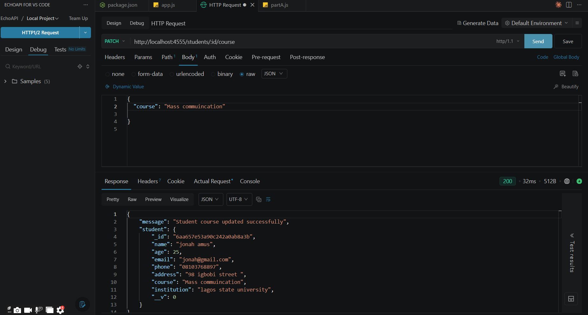
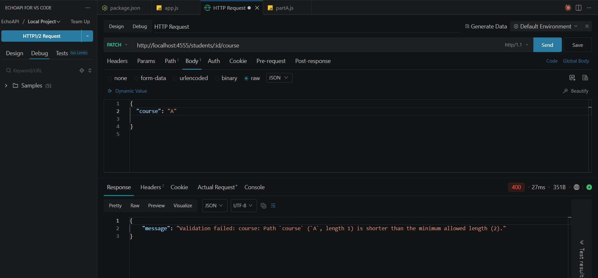
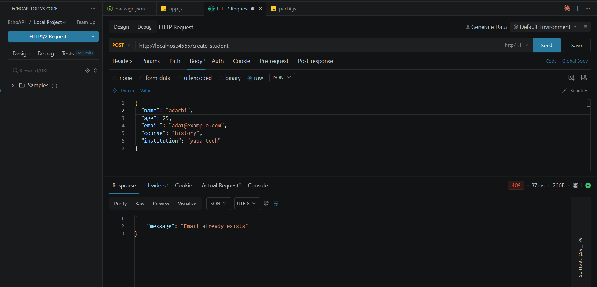
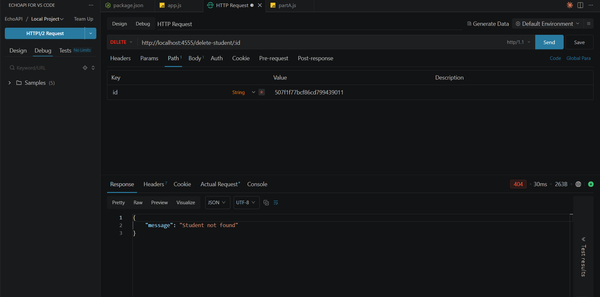

# Student Challenge: The "Ghost Student" Incident

A Node.js, Express, and MongoDB REST API for managing students.

This project was completed as part of the **"Ghost Student Incident"** challenge.

The challenge focused on diagnosing issues with student searching, updating, retrieving, deleting, validation, and duplicate emails, and then improving the API without breaking the existing routes.

---

## Technologies Used

* Node.js
* Express.js
* MongoDB
* Mongoose
* EchoAPI
* REST API

---

# Part A — My Answers

## Question 1

If two Adas exist in the database, `Student.find({ name })` will fetch both Adas in an array.

While `findOne()` would return one document instead of an array.

`find()` is used when you expect multiple possible matches, such as searching students by name.

`findOne()` is used when you only need one matching document.

---

## Question 2

The current code does a plain equality match:

```js
const { name } = req.query;
const student = await Student.find({ name });
```

MongoDB compares strings exactly as given — it does not ignore case and does not trim whitespace.

For example:

```text
/get-student-by-name?name=Ada
```

matches a document with:

```json
{
  "name": "Ada"
}
```

But:

```text
/get-student-by-name?name=ada
```

will not match `"Ada"` because:

```text
"ada" !== "Ada"
```

Similarly:

```text
/get-student-by-name?name=Ada%20
```

will not match `"Ada"` because `"Ada "` is different from `"Ada"`.

In each failing case, the query does not throw an error. It simply returns an empty result, which can make it look like the student does not exist.

The fix is to perform the matching inside MongoDB using a case-insensitive regular expression rather than fetching all students and filtering them in JavaScript:

```js
const { name } = req.query;

const student = await Student.find({
  name: { $regex: name.trim(), $options: "i" }
});
```

`$options: "i"` makes the match case-insensitive, so `ada`, `Ada`, and `ADA` are treated the same.

`.trim()` removes leading and trailing whitespace from the input before the query runs, so `"Ada "` can still match `"Ada"`.

This keeps the comparison work inside the database query instead of pulling every student into Node.js and filtering with `.filter()`, which does not scale well as the collection grows.

---

## Question 3

### Reason One: How the Endpoint Is Being Called

The route is defined as:

```js
app.put("/update-student/:id", async (req, res) => {
  const { id } = req.params;
```

This means the ID must be part of the URL path, not the request body.

For example:

```http
PUT http://localhost:4555/update-student/6a9718a135d8ee2f4a33ba87
```

If the admin instead sends the ID inside the JSON body while leaving it out of the URL, or uses the wrong ID in the URL, `req.params.id` will not match the student she actually intends to update.

`findByIdAndUpdate()` could then:

* Update the wrong document
* Find no document
* Throw a cast error

Any of these situations could make the response appear as though "nothing changed," giving the impression that the old document is still there.

The HTTP method also matters. If the request is accidentally sent as a `GET` or `POST` instead of `PUT`, it will not hit this route handler at all. The admin could then be looking at a read response instead of the result of an update.

### Reason Two: Mongoose Update Options

The route already includes:

```js
{ new: true }
```

`new: true` tells Mongoose to return the document **after** the update has been applied instead of the default behavior of returning the document as it was before the update.

Therefore, if `new: true` were missing or removed, the response sent back to the admin could show the old, pre-update version even though the update itself succeeded in the database.

Separately, `runValidators` is not currently set. Without:

```js
runValidators: true
```

Mongoose skips schema validation during update operations.

There is also a risk from how the update object is built:

```js
const { name, age, email, phone, address, course, institution } = req.body;
```

If the admin's request does not include every one of these fields, the missing fields become `undefined` after destructuring.

Passing an object containing undefined values into `findByIdAndUpdate()` can unintentionally affect existing fields instead of simply updating the field the admin intended to change.

For example, if the admin only wants to change the phone number, a partial update is better handled with `PATCH`, where only the fields actually provided are updated.

---

## Question 4

The current code is:

```js
const student = await Student.findById(id);

return res.status(200).json({
  message: "Student fetched successfully",
  student
});
```

### Valid ObjectId and Student Exists

`findById()` locates the matching document, and the route sends `200 OK` with the student data in the response body.

This case works correctly as-is.

### Valid ObjectId but Student Does Not Exist

When the ID is a properly formatted ObjectId but no document matches it, Mongoose's `findById()` does not throw an error. It simply resolves to `null`.

The current code does not check for that `null` value, so it still falls through to the success response:

```json
{
  "message": "Student fetched successfully",
  "student": null
}
```

This is sent with a `200 OK` status.

That is misleading because the request succeeded from the server's point of view, but the caller did not actually receive a student.

The fix is to explicitly check:

```js
if (!student)
```

and return:

```text
404 Not Found
```

A `404` correctly communicates that no student exists with that ID.

### Invalid ID, Such as `abc123`

This is a fundamentally different failure.

A valid MongoDB ObjectId has a specific format: a 24-character hexadecimal string.

When `"abc123"` is passed to `findById()`, Mongoose attempts to cast that string into an ObjectId before querying the database. The cast fails and Mongoose throws a `CastError`.

That error is caught by the existing catch block:

```js
} catch (error) {
  return res.status(500).json({
    message: "Internal server error"
  });
}
```

This results in:

```text
500 Internal Server Error
```

That is the wrong status code for this situation.

A `500` implies something went wrong unexpectedly on the server. However, in this case, the problem is that the client supplied an invalid ID.

This is a client-side input error and belongs in the `4xx` range.

### Why a CastError and a Missing Document Are Not the Same Bug

```text
CastError
Invalid ID format, e.g. abc123
→ The request itself is malformed
→ Should return 400 Bad Request

Valid ObjectId but no matching document
→ The request was valid and the query ran successfully
→ Nothing was found
→ Should return 404 Not Found
```

To handle both correctly, the application should validate the ObjectId before calling `findById()` and return `400 Bad Request` for an invalid ID.

The application should then separately check whether the returned student is `null` and return `404 Not Found` when the ID is valid but no student exists.

---

## Question 5

The actual collection name in MongoDB is `students`, not `Student`.

By default, Mongoose takes the model name, lowercases it, and pluralizes it.

For example:

```js
const Student = mongoose.model("Student", studentSchema);
```

creates a model called `Student`, but Mongoose uses the collection:

```text
students
```

This matters if someone bypasses the API and queries MongoDB directly. They need to use the real collection name, `students`, rather than the model name from the code.

MongoDB will not necessarily give an error if someone queries a collection called `Student`. It can simply query a collection that does not contain the expected documents and return an empty result.

---

## Question 6

This line in `app.js` is responsible for making JSON request bodies available through `req.body`:

```js
app.use(express.json());
```

`express.json()` parses incoming JSON request bodies.

However, the client must send the correct `Content-Type` header:

```text
Content-Type: application/json
```

Without the correct content type, Express may not parse the request body as JSON, and `req.body` may not contain the expected data.

As a result, fields destructured from `req.body` can become `undefined`, which can cause validation errors or result in fields not being saved as expected.

---

# Part C — Proof of Testing

All required API tests were performed using **EchoAPI** after updating `app.js`.

The screenshots below show the request and response for each required test.

---

## Test 1 — Case-Insensitive Student Search

### Request

```http
GET /search-students?q=ada
```

### What Was Tested

The search endpoint was tested using `q=ada`.

The database contained students named:

* Ada
* ADA

The search is expected to be case-insensitive and return both students.

### Expected Result

* Status: **200 OK**
* Response: Array
* Array contains both `Ada` and `ADA`

### Result

The test passed. The API returned both students in the response.

### Screenshot



---

## Test 2 — Search Without `q`

### Request

```http
GET /search-students
```

### What Was Tested

The `q` query parameter was intentionally omitted.

The API should not return the entire student database when no search text is provided.

### Expected Result

* Status: **400 Bad Request**
* Clear error message

### Result

The test passed. The API correctly returned **400 Bad Request**.

### Screenshot



---

## Test 3 — Invalid Student ID

### Request

```http
GET /get-student/abc123
```

### What Was Tested

An invalid MongoDB ObjectId was supplied.

The previous implementation allowed the Mongoose `CastError` to reach the generic error handler, resulting in a `500` response.

The updated implementation checks whether the ID is valid before calling `findById()`.

### Expected Result

* Status: **400 Bad Request**
* Not 500

### Result

The test passed. The API correctly identified `abc123` as an invalid student ID and returned **400 Bad Request**.

### Screenshot



---

## Test 4 — Valid ObjectId but Student Does Not Exist

### Request

```http
GET /get-student/507f1f77bcf86cd799439011
```

### What Was Tested

A valid-looking MongoDB ObjectId was supplied, but no student with that ID exists in the database.

### Expected Result

* Status: **404 Not Found**
* Student should not be returned as `null` with a 200 response

### Result

The test passed. The API correctly returned **404 Not Found**.

### Screenshot



---

## Test 5 — PATCH Student Course

### Request

```http
PATCH /students/:id/course
```

### Request Body

```json
{
  "course": "mass communication"
}
```

### What Was Tested

A real student's course was updated using the PATCH endpoint.

The response should contain the updated student rather than the old version.

### Expected Result

* Status: **200 OK**
* Response contains the student
* The `course` field shows the new course

### Result

The test passed. The response showed the updated course.

The update uses Mongoose's:

```js
new: true
```

option so that the updated document is returned.

### Screenshot



---

## Test 6 — Course Validation

### Request

```http
PATCH /students/:id/course
```

### Request Body

```json
{
  "course": "A"
}
```

### What Was Tested

A one-character course was submitted.

The schema contains a minimum length validation for the `course` field.

The PATCH operation also uses:

```js
runValidators: true
```

so that schema validation is applied during the update.

### Expected Result

* Status: **400 Bad Request**
* Validation error
* Not 500

### Result

The test passed. The API rejected the one-character course and returned **400 Bad Request**.

### Screenshot



---

## Test 7 — Duplicate Email

### First Request

```http
POST /create-student
```

```json
{
  "name": "Ada",
  "email": "ada1@example.com"
}
```

The first student was successfully created.

### Second Request

The same email was then submitted for another student:

```http
POST /create-student
```

```json
{
  "name": "adachi",
  "email": "ada1@example.com"
}
```

### What Was Tested

The email field was configured as unique in the Mongoose schema.

MongoDB returns duplicate-key error code `11000` when an existing unique value is inserted again.

The API handles this error and converts it to a `409 Conflict` response.

### Expected Result

* First request: **200 OK**
* Second request: **409 Conflict**

### Result

The test passed. The second student with the same email was rejected with **409 Conflict**.

### Screenshot



---

## Test 8 — Delete Student That Does Not Exist

### Request

```http
DELETE /delete-student/:id
```

A valid MongoDB ObjectId belonging to no student in the database was supplied.

### What Was Tested

The API should distinguish between:

* Successfully deleting an existing student
* Attempting to delete a student that does not exist

### Expected Result

* Status: **404 Not Found**

### Result

The test passed. The API correctly returned **404 Not Found** instead of reporting that a student was successfully deleted.

### Screenshot



---

# Test Summary

| # | Test                               | Expected                  | Result   |
| - | ---------------------------------- | ------------------------- | -------- |
| 1 | Search `q=ada`                     | 200, finds Ada and ADA    | ✅ Passed |
| 2 | Search without `q`                 | 400                       | ✅ Passed |
| 3 | Invalid ID `abc123`                | 400                       | ✅ Passed |
| 4 | Valid ID but student doesn't exist | 404                       | ✅ Passed |
| 5 | PATCH course                       | 200, updated course shown | ✅ Passed |
| 6 | PATCH course `"A"`                 | 400 validation error      | ✅ Passed |
| 7 | Duplicate email                    | Second request 409        | ✅ Passed |
| 8 | Delete nonexistent student         | 404                       | ✅ Passed |

---

# Conclusion

The API was tested against all eight required scenarios from the **"Ghost Student"** challenge.

The updated implementation correctly handles:

* Case-insensitive database searching
* Missing search queries
* Invalid MongoDB ObjectIds
* Students that do not exist
* Partial course updates
* Mongoose update validation
* Duplicate email addresses
* Missing required student information
* Honest delete responses

All required Part C tests passed successfully.
